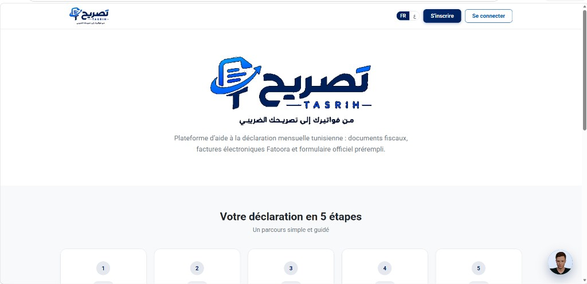
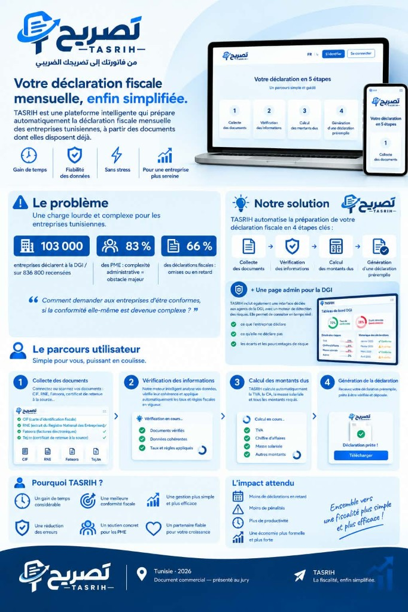
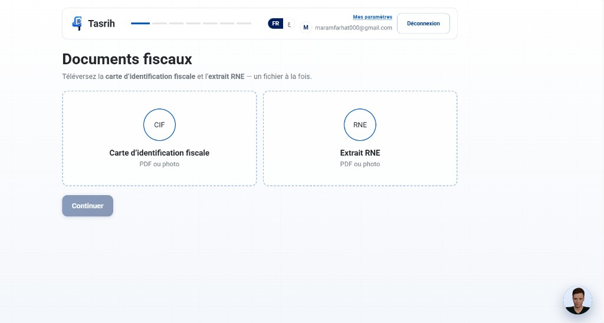
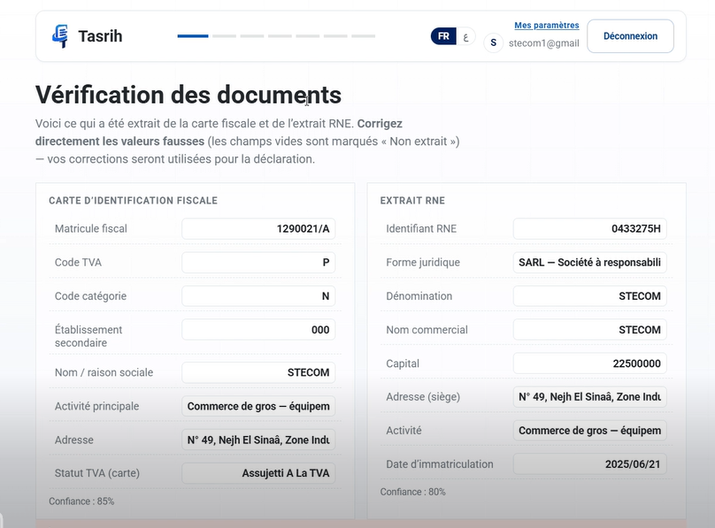
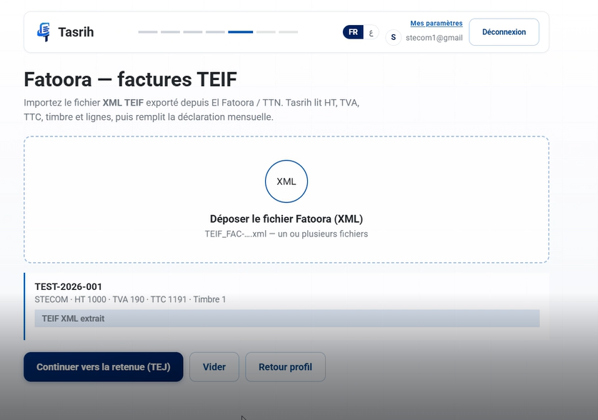
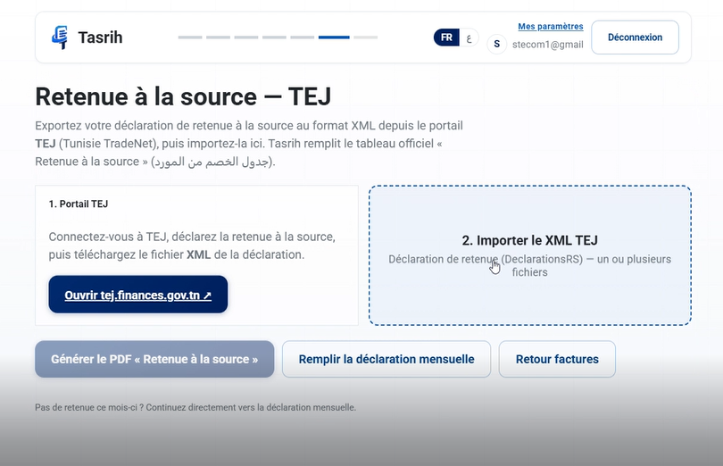
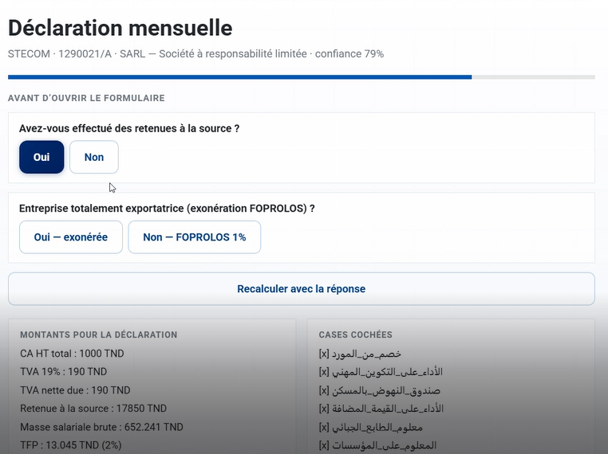
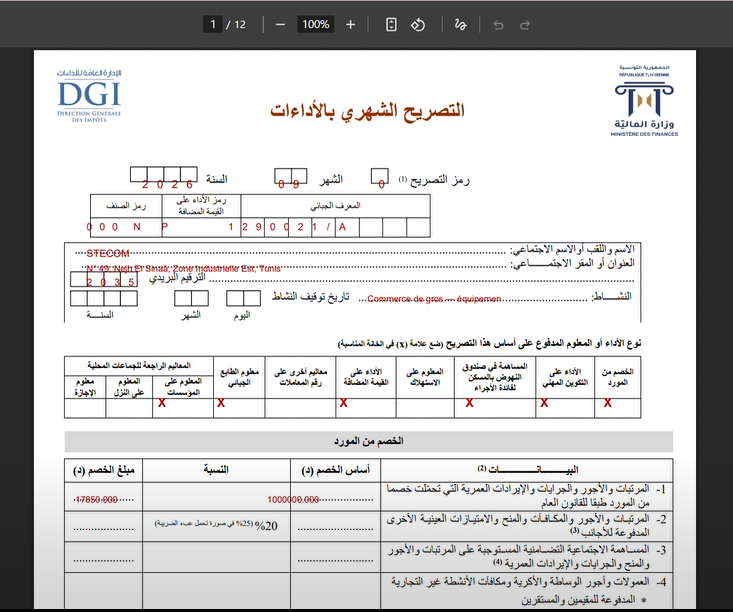

# Tasrih — تصريح

**Votre déclaration fiscale mensuelle tunisienne, enfin simplifiée.**

Tasrih est une plateforme d’aide à la **déclaration mensuelle des impôts** (DGI).  
Elle transforme vos pièces déjà disponibles — CIF, RNE, factures **Fatoora (TEIF)**, certificats **TEJ** et fiches de paie — en une déclaration préremplie, vérifiable, puis exportable au format officiel.

<p align="center">
  
</p>

<p align="center"><em>من فواتيرك إلى تصريحك الضريبي — Des factures à la déclaration.</em></p>

---

## Pourquoi Tasrih ?

En Tunisie, la conformité fiscale reste lourde pour les PME : documents dispersés, calculs manuels, risque d’erreurs et de retards. Tasrih réduit cette friction avec un parcours guidé, bilingue (FR / ع), et des contrôles automatiques.

| Bénéfice | Description |
|---|---|
| **Gain de temps** | OCR + import XML au lieu de ressaisie |
| **Fiabilité** | Montants dérivés des factures TEIF, TEJ et paie |
| **Clarté** | Taxes applicables / sans objet selon l’activité |
| **Conformité** | Export du formulaire officiel + quittance en attente DGI |

<p align="center">
  
</p>

---

## Parcours en 5 étapes

<p align="center">
  
</p>

1. **Documents fiscaux** — CIF + extrait RNE (OCR)
2. **Questions** — IS, personnel, canal de dépôt
3. **Factures Fatoora** — XML TEIF → TVA, HT, TTC, timbre
4. **Retenue à la source (TEJ)** — XML `DeclarationsRS` → tableau officiel
5. **Formulaire officiel** — déclaration mensuelle préremplie + PDF

### Captures du parcours

| Étape | Aperçu |
|---|---|
| Dépôt CIF / RNE |  |
| Vérification OCR |  |
| Documents du personnel |  |
| Factures Fatoora (TEIF) |  |
| Retenue TEJ |  |
| Déclaration mensuelle |  |
| PDF officiel prérempli |  |

---

## Fonctionnalités clés

### Contribuable
- Authentification et profil entreprise éditable
- Extraction OCR (CIF / RNE / fiches de paie) avec correctifs manuels
- Import XML **Fatoora TEIF** et **TEJ**
- Calcul automatique : TVA, TFP, FOPROLOS, retenue, timbre, etc.
- Export PDF de la **déclaration mensuelle** (`mensuelle2026.pdf`) prérempli
- **Quittance de paiement** générée, en attente d’approbation DGI
- Assistant conversationnel bilingue (voix + avatar 3D)

### Administration DGI (`/admin`)
- Tableau de bord séparé (clé admin)
- Suivi des déclarations et entreprises
- Moteur de détection de risques (écarts CA / factures, overrides matériels, chutes anormales)

---

## Stack

| Couche | Technologies |
|---|---|
| Frontend | React, TypeScript, Vite |
| Backend | FastAPI, Pydantic, Uvicorn |
| PDF | pypdf + ReportLab (overlay sur imprimé officiel) |
| IA / OCR | Groq, Tesseract, heuristiques documentaires |
| TTS | Edge TTS (repli Piper) |

---

## Démarrage rapide

### Prérequis
- Python 3.11+
- Node.js 18+
- Clé API Groq (`.env` à la racine)

```env
GROQ_API_KEY=votre_clé
ADMIN_PASSWORD=dgi-admin
```

### Windows
```bat
start-backend.bat
start-frontend.bat
```

### Linux / macOS
```bash
./start.sh
# ou séparément :
./start-backend.sh   # http://127.0.0.1:8010
./start-frontend.sh  # http://localhost:5180
```

| URL | Rôle |
|---|---|
| http://localhost:5180 | Espace contribuable |
| http://localhost:5180/admin | Administration DGI |
| http://127.0.0.1:8010/docs | API OpenAPI |

---

## Architecture (aperçu)

```
Tasrih/
├── frontend/          # React (contribuable + /admin)
├── backend/app/
│   ├── declaration/   # OCR, pipeline, calculs, fill_official PDF
│   ├── agent/         # Assistant + TTS
│   ├── knowledge/     # RAG guide fiscal
│   └── admin*.py      # Suivi DGI & détection
├── docs/screenshots/  # Captures README
└── start-*.bat / .sh
```

Principales routes API :
- `POST /extract/cif` · `/extract/rne` · `/extract/invoice` · `/extract/retenue` · `/extract/payslip`
- `POST /pipeline/build` · `/pipeline/export-official`
- `POST /export/retenue`
- `POST /declarations/save`
- `GET|POST /admin/...`

---

## Calculs fiscaux (résumé)

| Rubrique | Source | Règle |
|---|---|---|
| Retenue à la source | XML TEJ | assiette × taux certificat |
| TFP | masse salariale | 1 % industrie · 2 % autres |
| FOPROLOS | masse salariale | 1 % (exonération exportatrice totale) |
| TVA collectée | factures TEIF | 7 / 13 / 19 % |
| Droit de timbre | factures encaissées | 1 DT / facture |

L’applicabilité des taxes est déduite du **domaine d’activité** (CIF/RNE + réponses) : les rubriques hors périmètre sont marquées **sans objet (X)**.

---

## Licence & contexte

Projet académique / démonstration — Tunisie 2026.  
Document commercial et captures destinés à la présentation du produit.

**Tasrih — La fiscalité, enfin simplifiée.**
